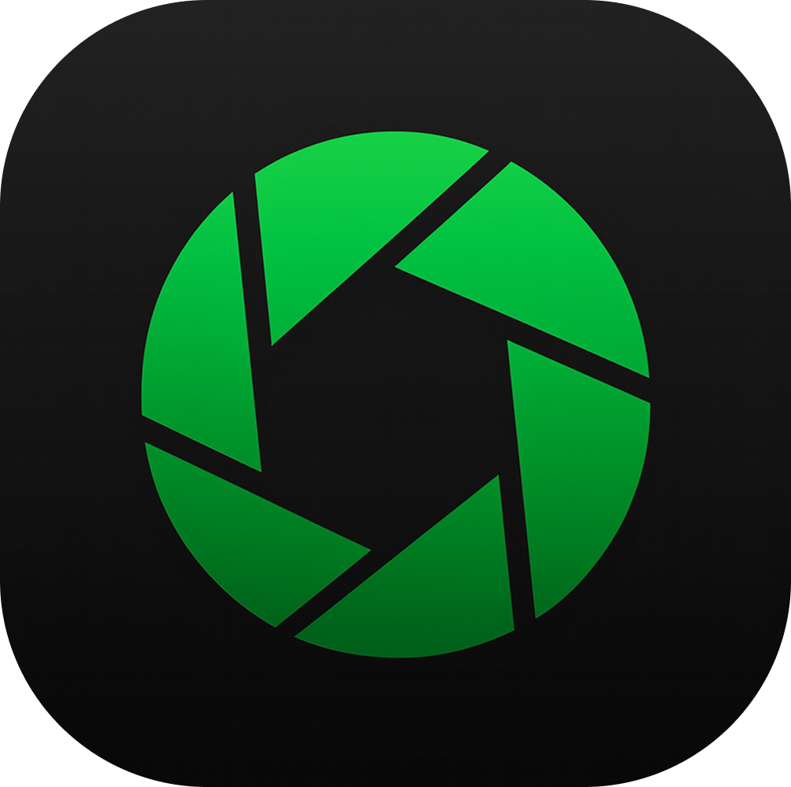

<p align="center">
  
</p>

# <p align="center">OpenScreen (日本語版)</p>

<p align="center"><strong>OpenScreen は、Screen Studio に代わる無料・オープンソースの選択肢です。</strong></p>

---

> [!WARNING]
> 現在ベータ版であり、開発中の機能やバグが含まれている可能性があります。

OpenScreen は、[Screen Studio](https://screen.studio/) のような美しいプロダクトデモやチュートリアル動画を、月額料金なしで作成したい方のためのツールです。シンプルながら、多くのユーザーが必要とする基本機能を高いクオリティで提供します。

## 🌟 主な特徴

- **自由な録画**: ウィンドウ指定、または全画面録画に対応。
- **インテリジェントズーム**: カーソルを追従するズーム機能。深度やタイミングも自由自在。
- **クリアな音声**: マイクとシステム音の同時収録が可能。
- **柔軟な編集**: クリップのトリミング、速度調整、注釈（テキスト/矢印）の追加。
- **美しい背景**: グラデーションやカスタム背景で、動画をプロフェッショナルな仕上がりに。
- **モーションブラー**: スムーズなアニメーション効果を実現。

## 📦 インストール方法

[GitHub Releases](https://github.com/siddharthvaddem/openscreen/releases) から、お使いの環境に合った最新のインストーラーをダウンロードしてください。

### macOS
開発者証明書未設定のため Gatekeeper にブロックされる場合は、ターミナルで以下を実行してください：
```bash
xattr -rd com.apple.quarantine /Applications/Openscreen.app
```
※システム設定で「画面収録」と「アクセシビリティ」の権限を許可する必要があります。

### Linux
`.AppImage` ファイルをダウンロードし、実行権限を付与して起動します：
```bash
chmod +x Openscreen-Linux-*.AppImage
./Openscreen-Linux-*.AppImage
```

## 🛠 使用技術
- **Electron** & **React**
- **TypeScript** & **Vite**
- **PixiJS** (レンダリングエンジン)
- **dnd-timeline**

## 🤝 貢献とライセンス
OpenScreen は [MIT ライセンス](./LICENSE) の下で公開されています。商用・個人利用を問わず、自由に使用・変更・配布が可能です。

---
_本リポジトリはオリジナルの OpenScreen を日本語にローカライズしたものです。_
